# Analyse des Offres d'Emploi LinkedIn avec Snowflake

## Introduction

Ce projet a été réalisé dans le cadre de l'évaluation d'Architecture Big Data à l'ESME Paris (2026). Il consiste à ingérer, stocker et analyser un jeu de données d'offres d'emploi LinkedIn en utilisant **Snowflake** comme entrepôt de données cloud et **Streamlit** pour la visualisation interactive.

Les données comprennent des fichiers au format **CSV** (offres d'emploi, entreprises, compétences) et **JSON** (données enrichies), chargées depuis un stage S3. L'objectif est de produire des analyses pertinentes sur le marché de l'emploi : titres les plus demandés, salaires par industrie, répartition par taille d'entreprise et type de contrat.

---

## Répartition des tâches

| Tâche | Axel Remillat | Mathis |
|---|---|---|
| Setup Snowflake (BDD, schéma, stage, formats) | ✅ | |
| Création des tables CSV | | ✅ |
| Création des tables JSON | ✅ | |
| Chargement des données CSV | | ✅ |
| Chargement des données JSON | ✅ | |
| Analyse 1 – Top 10 titres par industrie | ✅ | |
| Analyse 2 – Top 10 salaires par industrie | ✅ | |
| Analyse 3 – Répartition par taille d'entreprise | | ✅ |
| Analyse 4 – Répartition par secteur | | ✅ |
| Analyse 5 – Répartition par type d'emploi | | ✅ |
| Application Streamlit | ✅ | ✅ |

---

## Étape 1 - Setup Snowflake

Création de la base de données `linkedin`, du schéma `raw`, du stage S3 et des formats de fichier CSV et JSON. Cette étape initialise l'environnement complet avant tout chargement de données.

```sql
-- À compléter : voir sql/01_setup_axel.sql
```

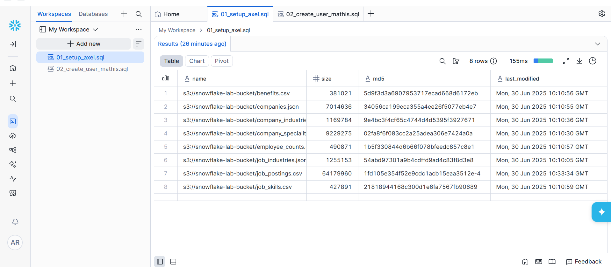

---

## Étape 2 - Création des tables CSV - Mathis

Définition des tables Snowflake destinées à accueillir les données structurées au format CSV : offres d'emploi, entreprises, compétences, niveaux de poste, etc.

```sql
-- À compléter : voir sql/05_create_tables_mathis.sql
```

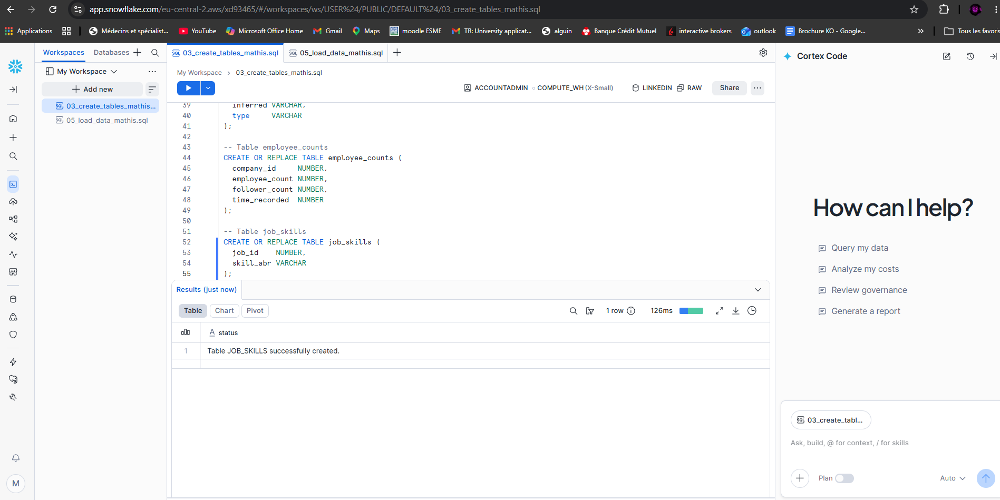

---

## Étape 3 - Création des tables JSON - Axel

Définition des tables Snowflake pour les données semi-structurées au format JSON, en utilisant le type `VARIANT` de Snowflake pour stocker les objets imbriqués.

```sql
-- À compléter : voir sql/02_create_tables_axel.sql
```

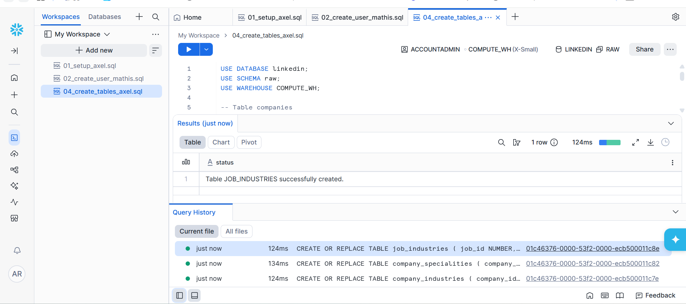

---

## Étape 4 - Chargement CSV - Mathis

Chargement des fichiers CSV depuis le stage S3 `@linkedin_stage` dans les tables correspondantes via la commande `COPY INTO`, en appliquant le format `csv_format`.

```sql
-- À compléter : voir sql/05_load_data_mathis.sql
```

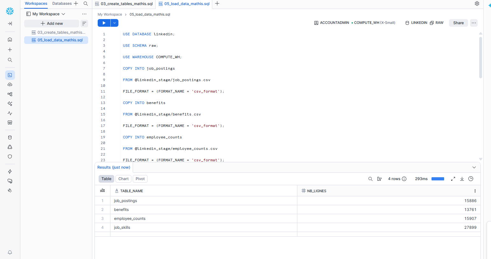

---

## Étape 5 - Chargement JSON - Axel

Chargement des fichiers JSON depuis le stage S3 dans les tables Snowflake de type `VARIANT`, via la commande `COPY INTO` avec le format `json_format`.

```sql
-- À compléter : voir sql/03_load_data_axel.sql
```

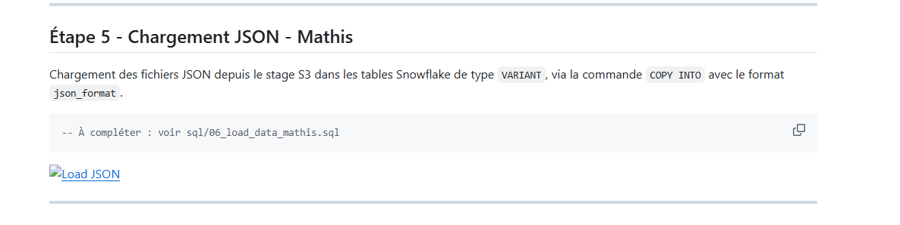

---

## Analyse 1 - Top 10 titres par industrie - Axel

Identification des 10 titres de poste les plus fréquents pour chaque industrie, en agrégeant les offres d'emploi et en les classant par nombre d'occurrences décroissant.

```sql
-- À compléter : voir sql/04_analytics_axel.sql
```

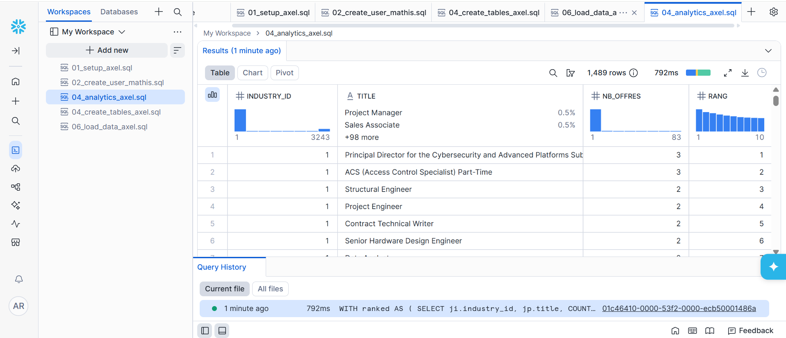

---

## Analyse 2 - Top 10 salaires par industrie - Axel

Calcul du salaire médian ou moyen par industrie, permettant d'identifier les secteurs les mieux rémunérés sur la base des offres LinkedIn disponibles.

```sql
-- À compléter : voir sql/04_analytics_axel.sql
```

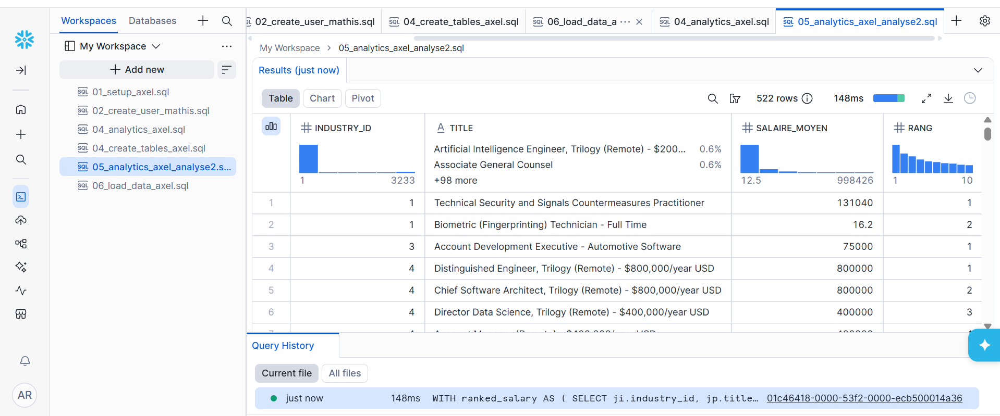

---

## Analyse 3 - Répartition par taille d'entreprise - Mathis

Visualisation de la distribution des offres d'emploi selon la taille des entreprises (startup, PME, grande entreprise), pour comprendre quels acteurs recrutent le plus.

```sql
-- À compléter : voir sql/07_analytics_mathis.sql
```

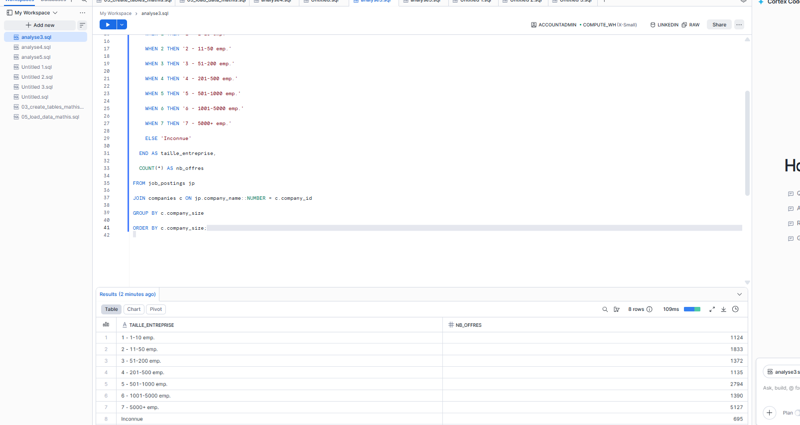

---

## Analyse 4 - Répartition par secteur - Mathis

Analyse de la répartition des offres d'emploi par secteur d'activité (Tech, Finance, Santé, etc.), afin d'identifier les domaines les plus actifs en recrutement.

```sql
-- À compléter : voir sql/07_analytics_mathis.sql
```

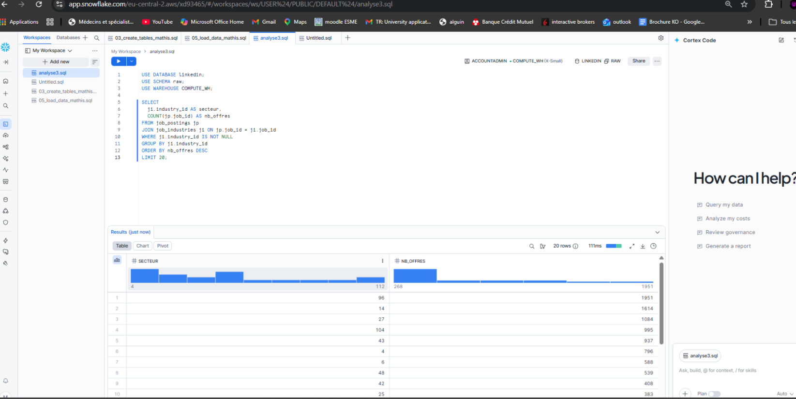

---

## Analyse 5 - Répartition par type d'emploi - Mathis

Étude de la distribution des offres selon le type de contrat (CDI, CDD, stage, freelance, temps partiel), pour cerner les tendances du marché de l'emploi.

```sql
-- À compléter : voir sql/07_analytics_mathis.sql
```

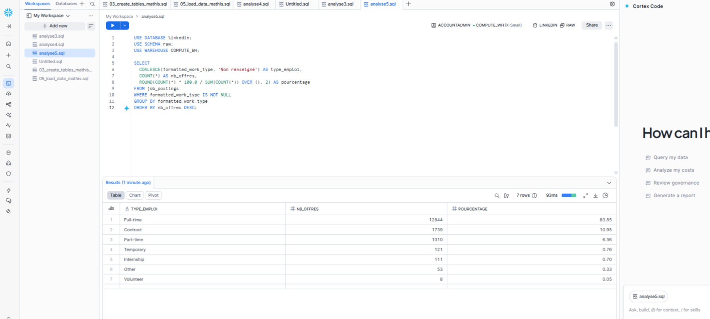

---

## Applications Streamlit

### App Axel - Analyses 1 & 2
Visualisation interactive des analyses 1 et 2 directement dans Snowflake via Streamlit.

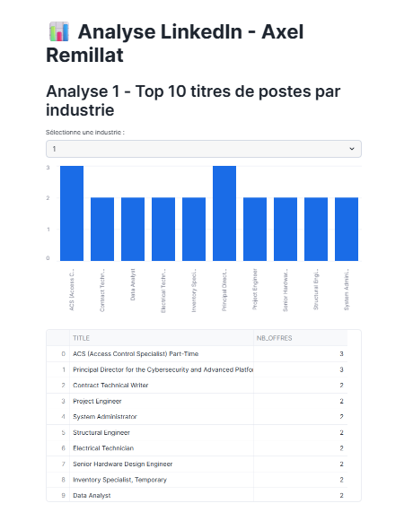
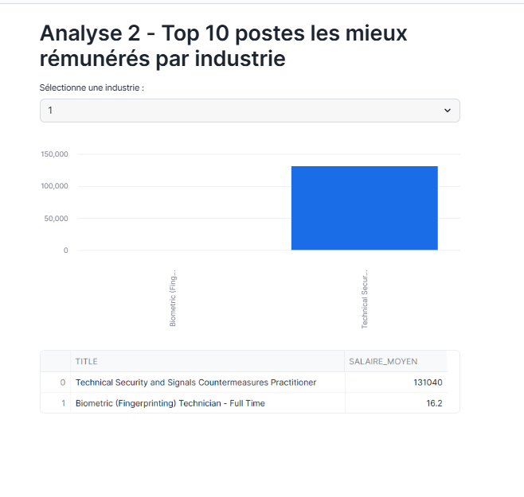

### App Mathis - Analyses 3, 4 & 5
Visualisation interactive des analyses 3, 4 et 5 directement dans Snowflake via Streamlit.

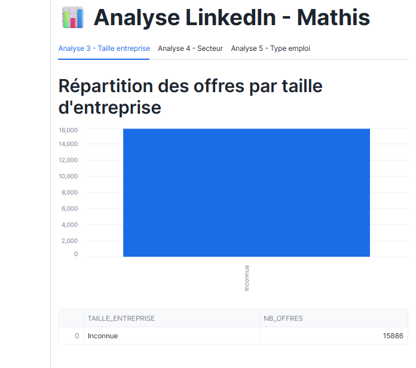
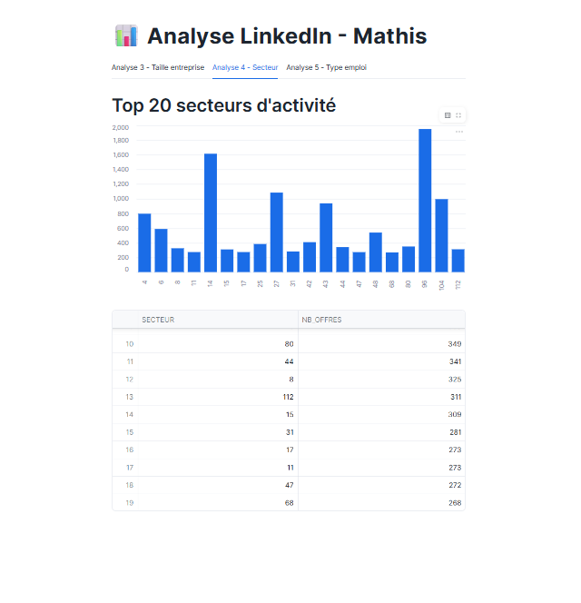
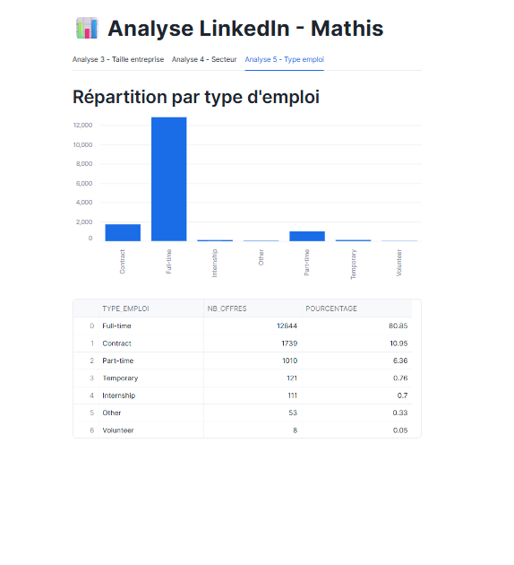

---

## Problèmes rencontrés et solutions

- *(À compléter)*

---

## Auteurs

- **Axel Remillat** — ESME Paris, 2026
- **Mathis [Nom]** — ESME Paris, 2026
